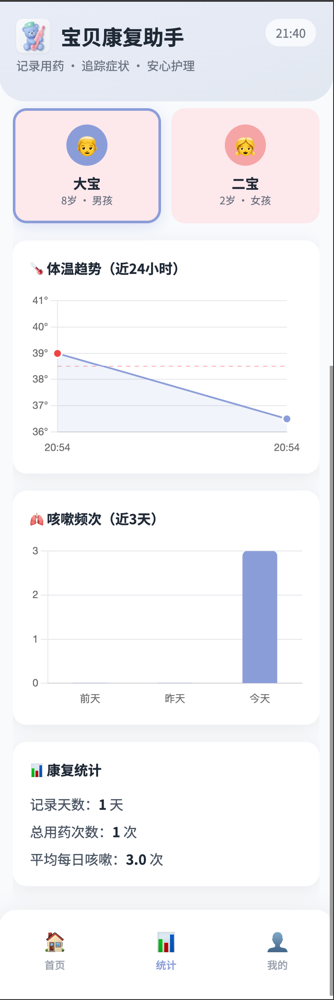
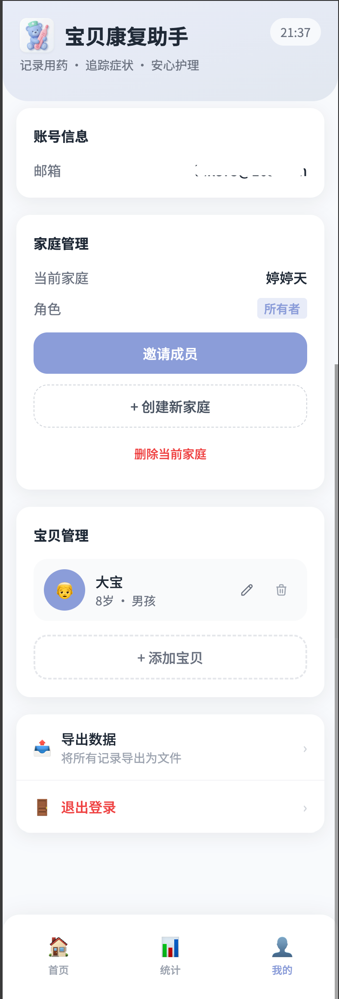

# 🏥 Kids Med Tracker | 宝贝用药追踪

<p align="center">
  
</p>

<p align="center">
  <strong>专为多孩家庭设计的儿童用药与症状追踪工具</strong>
</p>

<p align="center">
  <a href="#功能特性">功能特性</a> •
  <a href="#快速开始">快速开始</a> •
  <a href="#部署指南">部署指南</a> •
  <a href="#技术栈">技术栈</a> •
  <a href="#贡献指南">贡献指南</a>
</p>

<p align="center">
  
  
  
  
</p>

---

## 📖 项目背景

作为两个孩子的父亲，当孩子们同时感冒发烧时，我发现了一个痛点：

- **"刚才给谁吃的药？"**
- **"上次吃退烧药是几点？现在能再吃吗？"**
- **"今天咳嗽是不是比昨天严重了？"**

市面上的用药提醒App主要为慢性病设计，不适合这种"多孩子急性病"的场景。于是我做了这个工具。

## ✨ 功能特性

### 核心功能

| 功能 | 描述 |
|------|------|
| 🧒 **多孩子管理** | 支持多个孩子独立追踪，颜色区分防混淆 |
| ⏱️ **退烧药计时** | 自动计算距上次用药时间，智能提醒是否可再次用药 |
| 💊 **快速用药记录** | 预设常用药物，一键记录，支持剂量和体温 |
| 🫁 **咳嗽追踪** | 记录咳嗽频次和程度，观察病情趋势 |
| 🌡️ **体温记录** | 快捷温度按钮 + 自定义输入 |
| 📊 **趋势图表** | 体温曲线 + 咳嗽频次可视化，支持按病程筛选 |
| 🏥 **病程管理** | 区分不同病程周期，标记痊愈，查看历史病程统计 |
| 📤 **数据导出** | 一键导出记录，就诊时给医生参考 |
| 📱 **PWA支持** | 可添加到手机主屏幕，离线可用 |

### 设计原则

- **零思考录入**：一次点击完成记录，不需要打字
- **防混淆设计**：孩子间视觉强区分
- **极简操作**：为睡眠不足的父母设计
- **家庭协作**：同一家庭多成员共享记录
- **隐私优先**：通过 Supabase Auth 登录访问（支持密码或邮箱验证码），数据隔离到家庭

## 📱 应用截图

<p align="center">
  
  
  
</p>

<p align="center">
  <em>首页 · 统计 · 我的</em>
</p>

## 🚀 快速开始

### 环境要求

- Node.js >= 18
- pnpm >= 8（推荐）或 npm >= 9

### 本地开发

> 本项目使用 **Cloudflare Worker 托管前端静态资源 + API** 架构。

#### 1. 克隆并安装依赖

```bash
git clone https://github.com/your-username/kids-med-tracker.git
cd kids-med-tracker
pnpm install
```

#### 2. 配置环境变量

```bash
# 前端环境变量
cp .env.example .env.local

# Worker 本地变量
cp .dev.vars.example .dev.vars
```

**`.env.local` 配置说明：**

| 变量 | 说明 | 本地开发值 |
|------|------|------------|
| `VITE_TURNSTILE_SITE_KEY` | Turnstile 站点密钥 | 可留空 |
| `VITE_DEV_USER_EMAIL` | 本地模拟登录邮箱 | `test@example.com` |

**`.dev.vars` 配置说明：**

| 变量 | 说明 | 本地开发值 |
|------|------|------------|
| `ENV` | 运行环境 | `local` |
| `SUPABASE_URL` | Supabase 项目 URL | 你的 Supabase URL |
| `SUPABASE_ANON_KEY` | Supabase anon key | 你的 anon key |
| `SUPABASE_SERVICE_ROLE_KEY` | Supabase service role key | 你的 service key |
| `TURNSTILE_SECRET_KEY` | Turnstile 密钥 | `dev`（跳过校验） |
| `INVITE_TOKEN_PEPPER` | 邀请链接加密盐 | `dev` |

#### 3. 启动开发服务器

**方式一：全栈开发（推荐，与线上一致）**

```bash
# 先构建前端
pnpm build

# 启动 Worker（含前端 + API）
pnpm worker:dev
```

访问 http://localhost:8787

**方式二：纯前端开发（热更新）**

```bash
pnpm dev
```

访问 http://localhost:5173（API 需另行配置代理）

#### 4. 常用命令

| 命令 | 说明 |
|------|------|
| `pnpm dev` | 启动前端开发服务器（热更新） |
| `pnpm build` | 构建前端到 `dist/` |
| `pnpm worker:dev` | 启动本地 Worker |
| `pnpm test` | 运行单元测试 |
| `pnpm test:watch` | 监听模式运行测试 |
| `pnpm lint` | ESLint 检查并修复 |

#### 5. 本地开发特性

- **跳过认证**：`ENV=local` 时，Worker 跳过 Cloudflare Access JWT 校验
- **跳过 Turnstile**：token 为 `dev` 时跳过人机校验
- **模拟用户**：通过 `VITE_DEV_USER_EMAIL` 注入测试身份

## 📦 部署指南

本项目使用 **Supabase**（数据库 + 认证）+ **Cloudflare Workers**（托管前端 + API）架构。

### 前置要求

- Node.js >= 18
- pnpm >= 8
- [Cloudflare 账号](https://dash.cloudflare.com/)
- [Supabase 账号](https://supabase.com/)

---

### 第一步：创建 Supabase 项目

1. 登录 [Supabase Dashboard](https://supabase.com/dashboard)
2. 点击 **New Project**，填写项目名称
3. 选择数据库区域（建议选择离用户最近的区域，如 `ap-northeast-1` 东京）
4. 设置数据库密码（妥善保管）
5. 等待项目初始化完成（约 1-2 分钟）

### 第二步：初始化数据库

1. 进入 Supabase Dashboard → **SQL Editor**
2. 点击 **New Query**
3. 复制 [`supabase/schema.sql`](./supabase/schema.sql) 文件的全部内容
4. 粘贴到编辑器并点击 **Run** 执行
5. 确认输出 `Success. No rows returned` 表示执行成功

### 第三步：配置 Supabase 认证

1. 进入 **Authentication** → **Providers**
2. 确认 **Email** 已启用（默认启用）
3. **关闭 "Confirm email"** 选项（重要！）
   - 默认情况下，新用户首次注册会收到"确认链接"邮件，而非 6 位验证码
   - 关闭此选项后，新用户和老用户都会收到统一的 OTP 验证码，体验一致
4. 进入 **Authentication** → **Email Templates**
5. （可选）自定义 OTP 验证码邮件模板

### 第四步：获取 Supabase 密钥

进入 **Settings** → **API**，记录以下信息：

| 名称 | 用途 | 安全级别 |
|------|------|----------|
| Project URL | `SUPABASE_URL` | 公开 |
| anon/public key | `SUPABASE_ANON_KEY` | 公开（前端可用） |
| service_role key | `SUPABASE_SERVICE_ROLE_KEY` | **机密**（仅后端） |

---

### 第五步：配置 Cloudflare Workers

#### 5.1 安装 Wrangler CLI

```bash
pnpm add -g wrangler
wrangler login
```

#### 5.2 修改 `wrangler.toml`

编辑项目根目录的 `wrangler.toml`，修改以下配置：

```toml
name = "kids-med-tracker"  # 你的 Worker 名称
main = "worker/index.ts"
compatibility_date = "2026-01-11"

assets = { directory = "./dist", binding = "ASSETS" }

[vars]
SUPABASE_URL = "https://你的项目ID.supabase.co"  # 替换为你的 Project URL
APP_URL = "https://你的域名.com"                  # 替换为你的应用域名
ENV = "production"
```

#### 5.3 配置 Worker Secrets

以下密钥必须通过命令行设置（不要写入配置文件）：

```bash
# Supabase anon key（前端 RLS 校验用）
wrangler secret put SUPABASE_ANON_KEY

# Supabase service role key（后端特权操作用）
wrangler secret put SUPABASE_SERVICE_ROLE_KEY

# 邀请链接 token 加密盐（随机生成一串字符）
wrangler secret put INVITE_TOKEN_PEPPER
```

#### 5.4（可选）配置 Turnstile 人机验证

如需启用 Cloudflare Turnstile 防滥用：

1. 在 [Cloudflare Dashboard](https://dash.cloudflare.com/) → **Turnstile** 创建站点
2. 获取 Site Key 和 Secret Key
3. 配置：

```bash
# 在 wrangler.toml [vars] 中添加（公开）
TURNSTILE_SITE_KEY = "你的站点密钥"

# 通过命令行设置（机密）
wrangler secret put TURNSTILE_SECRET_KEY
```

---

### 第六步：构建并部署

```bash
# 安装依赖
pnpm install

# 构建前端（输出到 dist/）
pnpm build

# 部署 Worker
pnpm worker:deploy
```

部署成功后，Wrangler 会输出你的 Worker URL（如 `https://kids-med-tracker.你的账号.workers.dev`）。

### 第七步：绑定自定义域名（可选）

1. 进入 [Cloudflare Dashboard](https://dash.cloudflare.com/) → **Workers & Pages**
2. 选择你的 Worker → **Settings** → **Triggers**
3. 点击 **Add Custom Domain**，输入你的域名
4. 按提示完成 DNS 配置

---

### 其他平台

由于依赖 Cloudflare Workers + Supabase，本项目不推荐部署到 Vercel/Netlify/纯静态托管。

## 🛠️ 技术栈

| 技术 | 用途 |
|------|------|
| [Vue 3](https://vuejs.org/) | 前端框架 |
| [Vite](https://vitejs.dev/) | 构建工具 |
| [TailwindCSS](https://tailwindcss.com/) | CSS框架 |
| [Pinia](https://pinia.vuejs.org/) | 状态管理 |
| [vue-i18n](https://vue-i18n.intlify.dev/) | 国际化（zh-CN/en-US） |
| [Chart.js](https://www.chartjs.org/) | 图表库 |
| [vite-plugin-pwa](https://vite-pwa-org.netlify.app/) | PWA支持 |
| [Cloudflare Workers](https://developers.cloudflare.com/workers/) | 托管前端静态资源 + API |
| [Hono](https://hono.dev/) | Worker API 路由框架 |
| [Supabase](https://supabase.com/) | 数据库 + 认证（密码 / Email OTP） |
| [Cloudflare Turnstile](https://developers.cloudflare.com/turnstile/) | 人机校验（防滥用） |

## 📁 项目结构

```
kids-med-tracker/
├── public/                   # 静态资源
│   ├── logo.svg              # 应用 Logo
│   └── icons/                # PWA 图标
├── client/                   # 前端 Vue 应用
│   ├── components/           # Vue 组件
│   ├── i18n/                 # 国际化资源（zh-CN/en-US）
│   ├── stores/
│   │   └── records.js        # Pinia 状态管理
│   ├── views/                # 路由页面
│   ├── lib/                  # Supabase 客户端
│   ├── App.vue               # 根组件
│   ├── main.js               # 入口文件
│   └── style.css             # 全局样式
├── worker/                   # 后端 Cloudflare Worker
│   ├── index.ts              # Worker 入口
│   ├── routes/               # Hono API 路由
│   ├── services/             # 业务逻辑层
│   ├── middleware/           # 认证中间件
│   └── lib/                  # Supabase 客户端
├── supabase/                 # 数据库相关
│   └── schema.sql            # 完整数据库 Schema（表 + RLS 策略）
├── wrangler.toml             # Worker 配置
├── vite.config.js            # 前端构建配置
└── package.json
```

## 🎨 自定义配置

### 孩子与家庭

- 孩子数据存储在云端（Supabase PostgreSQL）。
- 只有 `owner` 可新增/编辑/删除孩子；`member` 只读。

### 预设药物

目前预设药物仍在前端配置：
- `client/stores/records.js` 的 `medications`

### 本地调试（可选）

- `.env.local`：可设置 `VITE_DEV_USER_EMAIL=you@example.com` 用于本地 `ENV=local` 注入身份
- `.dev.vars`：可设置 `ENV=local`、`TURNSTILE_SECRET_KEY=dev`、`INVITE_TOKEN_PEPPER=dev`（不要提交）

## 🔒 隐私说明

- ✅ **数据存储在 Supabase**（PostgreSQL 云端数据库），用于家庭成员协作与多设备访问。
- ✅ **访问受 Supabase Auth 保护**（支持密码登录 + 邮箱验证码 OTP 登录）。
- ✅ **数据按家庭隔离**：登录后仍需加入某个家庭才可访问该家庭的数据。
- ✅ **完全开源可审计**。

> 重要：这是一款健康/用药记录工具，请在部署与使用时谨慎管理邀请链接。
## 🤝 贡献指南

欢迎贡献代码！请遵循以下步骤：

1. Fork 本仓库
2. 创建特性分支 (`git checkout -b feature/AmazingFeature`)
3. 提交更改 (`git commit -m 'Add some AmazingFeature'`)
4. 推送到分支 (`git push origin feature/AmazingFeature`)
5. 提交 Pull Request

### 开发规范

- 使用 Vue 3 Composition API
- 遵循 Vue 官方风格指南
- 组件命名使用 PascalCase
- 使用 ESLint + Prettier 格式化代码

### Issue 反馈

如有问题或建议，欢迎 [提交 Issue](https://github.com/your-username/kids-med-tracker/issues)。

## 📋 Roadmap

- [x] 基础用药记录
- [x] 咳嗽追踪
- [x] 体温图表
- [x] 数据导出
- [x] 多语言支持 (i18n)
- [x] 数据云端存储（Supabase）
- [x] 家庭成员共享（角色权限）
- [x] 病程管理（区分病程周期、历史统计）
- [x] 密码登录（可选，支持密码 + OTP 双模式）
- [ ] 用药提醒通知
- [ ] 深色模式

## 📄 License

[MIT License](./LICENSE) © 2025

---

## 💡 致谢

感谢所有为孩子健康操心的父母们。希望这个小工具能在你疲惫的深夜提供一点帮助。

**孩子们早日康复！** 🙏

---

<p align="center">
  如果这个项目对你有帮助，欢迎 ⭐ Star 支持一下！
</p>
